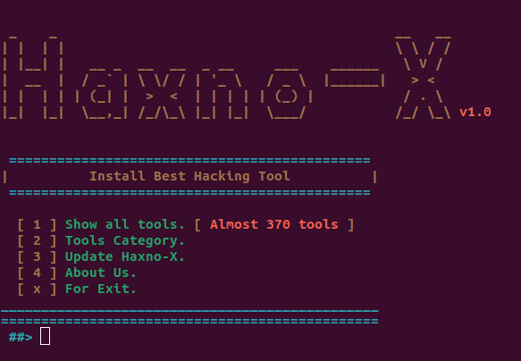
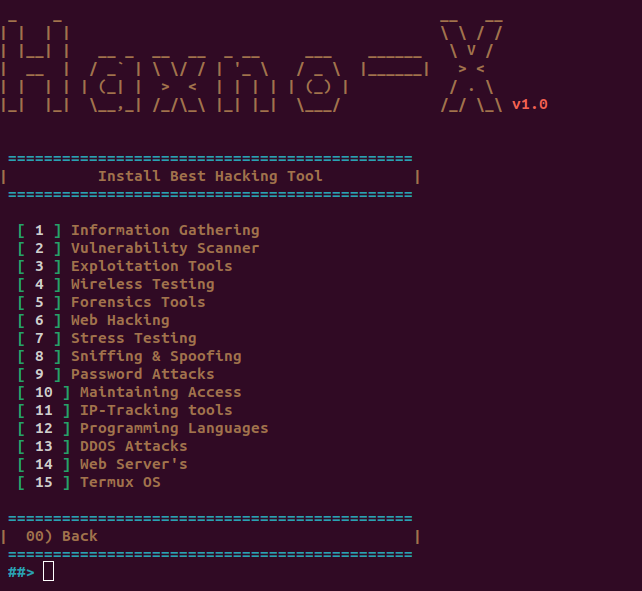

### Introduction

*Haxno-X is a Kali Linux hacking tools installer for Termux and linux system.*
Haxno-X was developed for Termux & other android terminals. Using Haxno-X, you can install almost 370+ hacking tools in Termux (android) and other Linux based distributions. Now Haxno-X is available for Ubuntu, Debian etc.

 

------------------------------------------------------------------------

### Operating System Requirements

Haxno-X works on any of the following operating systems: 
• **Android** (Using the Termux App)  
• **Linux** (Debian Based Systems)  

------------------------------------------------------------------------

### How to Install

Open the terminal and type following commands.

* `apt update`

* `apt install git`

* `git clone https://github.com/haxnology/Haxno-X.git`

* `cd Haxno-X`

* `chmod +x install.aex`

* `sh install.aex` if not work than use `./install.aex`

------------------------------------------------------------------------

### How to Use ?

Enter a Number for a specific output:
- (0) : To install all tools.
- (1) : To show all available tools and type the number of a tool which you want to install.
- (2) : To show tools category.
- (3) : For the install of the operating system in Termux
- (4) : If you want to update Haxno-X.
- (5) : If you want to know About Us.
- (x) : To exit the tool.

 

***Now Haxno-X is installed successfully. To run Haxno-X Type `Haxno-X` or `haxnox` in your terminal.***

Type `Haxno-X` or `haxnox` from anywhere in your terminal to open Haxno-X.

------------------------------------------------------------------------

**Warning**

use this tool at your own risk!
